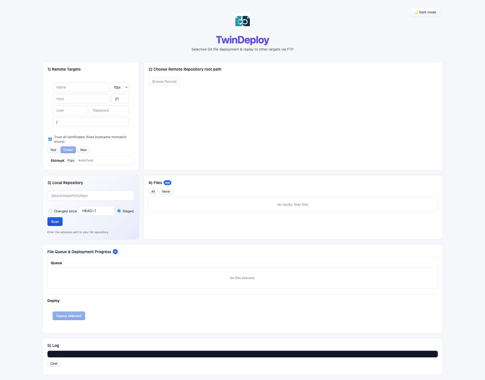

# TwinDeploy 🚀

> A local web app for selective Git file deployment to SFTP/FTPS targets

[](https://opensource.org/licenses/MIT)
[](https://nodejs.org/)
[](https://reactjs.org/)

**TwinDeploy** is a small **local web app** that detects **changed or staged Git files**, lets you **choose exactly which files to deploy**, uploads them to **SFTP/FTPS targets**, and can **replay the exact same batch** to another target (e.g., *dev → qa → production*) — all from your browser.

## 📸 Screenshot



**Figure 1:** TwinDeploy's intuitive interface showing the complete deployment workflow from Git file detection to SFTP/FTPS deployment

## ✨ Key Features

- 🔍 **Smart Git Detection**: Find changed files since any commit/branch or only staged files
- ✅ **Selective Deployment**: Checkbox interface to choose exactly which files to deploy
- 🎯 **Multiple Targets**: Manage SFTP/FTPS servers with profiles (dev, staging, production)
- 🔄 **Deployment Replay**: Deploy the same file set to different targets instantly
- 📊 **Real-time Progress**: Live deployment progress with Server-Sent Events
- 📁 **Remote Browser**: Browse and edit files directly on remote servers
- 📝 **Deployment History**: Track all deployments with timestamps and results
- 🌙 **Dark Mode**: Modern interface with light/dark theme support

## 🛠 Tech Stack

- **Backend**: Node.js + Express + Server-Sent Events
- **Frontend**: React + Vite
- **Git Integration**: `simple-git`
- **File Transfer**: `ssh2-sftp-client` (SFTP) + `basic-ftp` (FTPS)
- **Storage**: JSON files (SQLite migration planned)

## 🚀 Quick Start

```bash
# 1) Clone and install dependencies
git clone git@github.com:ShirleyKyeyune/TwinDeploy.git
cd TwinDeploy
npm install

# 2) Install backend dependencies
cd backend && npm install

# 3) Install frontend dependencies
cd ../frontend && npm install

# 4) Start development servers
cd .. && npm run dev

# Open http://localhost:5173 in your browser
```

> 💡 **Note**: TwinDeploy doesn't move or clone your repositories. You point it at existing local Git repos and it reads diffs and streams files during deployment.

## 📖 How It Works

### 1. **Setup Targets**

Configure your deployment targets (dev, staging, production) with SFTP/FTPS credentials.

### 2. **Choose Repository**

Point to your local Git repository and select the remote deployment path.

### 3. **Scan for Changes**

- **Changed since**: Compare against any branch/commit/tag
- **Staged files**: Deploy only staged changes

### 4. **Select Files**

Use the checkbox interface to choose exactly which files to deploy.

### 5. **Deploy & Track**

Watch real-time progress as files are uploaded to your target server.

### 6. **Replay Deployments**

Instantly deploy the same file set to different targets (dev → staging → production).

## 🔧 Configuration

### Environment Variables (Optional)

Create `backend/.env`:

```bash
PORT=9547                    # Backend port (default: 9547)
DATA_DIR=./data             # Storage directory (default: backend/.data)
```

### Target Configuration

Each target includes:

- **Name**: Friendly identifier
- **Protocol**: SFTP or FTPS
- **Host**: Server hostname/IP
- **Port**: Connection port (22 for SFTP, 21 for FTPS)
- **Credentials**: Username/password or SSH key
- **Remote Root**: Base deployment directory

## 📁 Project Structure

```text
TwinDeploy/
├── backend/                 # Node.js Express API
│   ├── index.js            # Main server + API routes
│   ├── deploy.js           # SFTP/FTPS upload logic
│   ├── git.js              # Git file detection
│   ├── store.js            # JSON data persistence
│   └── .data/              # Storage (auto-created)
├── frontend/               # React Vite frontend
│   ├── src/
│   │   ├── App.jsx         # Main application
│   │   ├── api.js          # API client functions
│   │   └── styles.css      # UI styling
│   └── dist/               # Built files (auto-created)
├── docs/                   # Documentation assets
│   └── TwinDeploy_screenshot.png      # Application screenshot
└── package.json            # Root scripts
```

## 🛣 Roadmap

### 🚀 High Priority

- [ ] **Local Repository Browser**: Browse and manually select files beyond Git changes
- [ ] **File Conflict Resolution**: Handle overwrites with backup options
- [ ] **Deployment Templates**: Save common deployment configurations
- [ ] **Progress Persistence**: Resume interrupted deployments

### 🎯 Medium Priority

- [ ] **Advanced File Filtering**: Exclude patterns and content-based filters
- [ ] **Target Health Check**: Verify connectivity before deployment
- [ ] **Deployment Scheduling**: Queue and time-based deployments
- [ ] **File Comparison**: Visual diff between local and remote files

### 💡 Future Enhancements

- [ ] **Multi-Repository Support**: Manage multiple Git repositories
- [ ] **Team Collaboration**: Share configurations and deployment history
- [ ] **CI/CD Integration**: Webhook triggers from GitHub/GitLab
- [ ] **Docker Support**: Containerized deployment targets

## 🐛 Troubleshooting

### Common Issues

#### Repository not found

- Ensure the repository path is absolute and points to a valid Git repository

#### SFTP connection failed

- Check hostname, username, and SSH key path
- Verify SSH key permissions (`chmod 600 ~/.ssh/id_rsa`)

#### Permission denied

- Ensure the remote user has write permissions to the target directory

#### Port conflicts

- Change the PORT in `backend/.env` if 9547 is already in use

### Getting Help

- Check the browser console for detailed error messages
- Review the built-in log panel for deployment progress
- Open an issue if you encounter bugs or need features

## 🔐 Security Notes

- **Local Only**: Designed to run locally, not as a public service
- **Credential Storage**: Connection details stored in local JSON files
- **No Authentication**: Add authentication before deploying publicly
- **SSH Keys**: Supports SSH key authentication for SFTP

## 🤝 Contributing

Contributions are welcome! Here's how to get started:

1. **Fork** the repository
2. **Create** a feature branch (`git checkout -b feature/amazing-feature`)
3. **Commit** your changes (`git commit -m 'Add amazing feature'`)
4. **Push** to the branch (`git push origin feature/amazing-feature`)
5. **Open** a Pull Request

See [CONTRIBUTING.md](CONTRIBUTING.md) for detailed guidelines.

## 📄 License

MIT License - see [LICENSE](LICENSE) file for details.

---

## ⭐ Show Your Support

Give a ⭐️ if this project helped you streamline your deployment workflow!

---

## Made with ❤️ for developers who want better deployment control especially for WordPress sites
